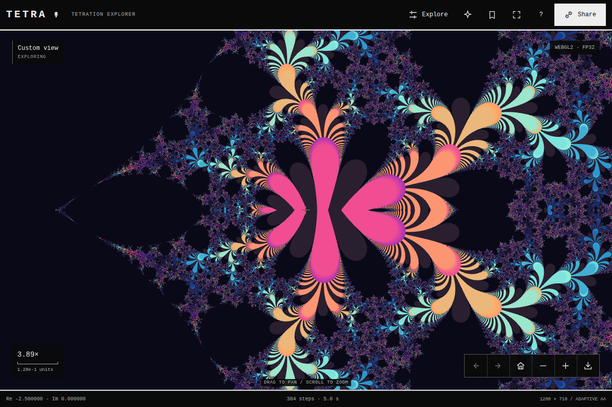

# TETRA

A browser-native tetration explorer. Inspect internal fractal structure down to span `1e-200`, discover new places, save coordinates and share exact views.



[](https://github.com/MongLong0214/Tetration/actions)

**1.0.0** · Live at **[tetration.vercel.app](https://tetration.vercel.app)**. Device qualification is tracked in the [production review](docs/PRODUCTION_REVIEW.md). The app observes finite iterations; it does not prove convergence or divergence.

## Explore

The map fills the workspace. Drag, scroll or pinch anywhere: the image follows immediately and keeps refining while you move. Live frames stay locked to the fractal's pixel grid and gather up to 16 orbit samples per pixel over successive frames, to limit shimmer during movement. When you pause, it resolves within the selected engine’s pixel budget and then smooths edges with up to 16 orbit samples per pixel.

| Action | Input |
| --- | --- |
| Pan | Drag (with inertia) / arrow keys; Shift + arrow for larger steps |
| Zoom | Scroll / pinch / + and − |
| Zoom into a point | Double-click |
| Inspect a small structure | Detail / Shift-drag / Z then drag; Escape cancels |
| Discover a new detailed place | D or the ✦ button |
| Overview / starting points | Home / 1–7 |
| Previous / next view | Alt + Left / Right |
| Focus / controls | F / C |
| Saved views / share / save image | B / S / E |
| Grid / guide | G / ? |

The app opens on the overview of the complex plane (centre −0.5, width 8). Seven starting points range from it through **Bloom** (internal petals, span 0.00025) to **Plume** (10¹¹), **Abyss** (10²⁵) and **Horizon** (10¹⁰⁰). Palettes: **Aurora**, **Ember**, **Tidal** and **Mono**. Escape bands keep cycling through the palette at depth, where every pixel needs thousands of steps. Optional **Color flow** rotates hues without recomputing; it starts off, pauses in a hidden tab and stops when reduced motion is requested.

**Share** copies the exact view link (or opens the native share sheet on touch devices). **Save image** downloads a PNG at the rendered resolution; on touch devices that support file sharing it opens the share sheet with the image. Up to 24 named views can be saved on the device. TETRA installs as an app and reopens offline.

## Run

Node.js 22 or 24; `.nvmrc` selects 24. No npm installation is required to build or run the app.

```bash
npm test
npm run dev        # builds, then serves http://localhost:4173
npm run build      # dist/: index.html, sw.js, manifest.webmanifest, icons
npm start          # serve the build
```

The development server binds to loopback; use `HOST=0.0.0.0` only for intentional LAN testing. There is no file watcher: rebuild after editing. Service workers and clipboard sharing need HTTPS (or localhost).

## Computation

For each complex base `z`:

```text
w₀ = 1
wₙ₊₁ = exp(wₙ · Log(z))
Arg(z) ∈ (−π, π]; the negative real axis uses +π
```

Zero is excluded. This is finite, integer-height iteration, not an analytic extension to arbitrary heights.

| Observation | Interpretation |
| --- | --- |
| Fixed-point candidate | Consecutive values repeatedly approach within a tolerance |
| Period-2 candidate | Values repeatedly approach the value two steps earlier |
| Unresolved | No other stopping condition within the iteration limit |
| Threshold crossed | Re(w · Log z) exceeded ln 10¹⁰, i.e. the next |w| would pass 10¹⁰ |
| Numerical limit | Undefined input, underflow, or a phase too large to resolve |

**No shade proves convergence, periodicity or divergence.** Engines differ in numerical tolerance, so boundaries and chaotic regions can change between engines.

### Deep zoom by perturbation

Automatic uses direct FP32 or perturbation on the GPU for ordinary views. At caps of 8192 or more, relative spans at FP64 scales use FP64 Workers only when WebGPU compute is unavailable (with it, the WebGPU kernel is about 3× faster and keeps live frames); GPU AA passes at 8192+ iterations (4×/16×) or 4096+ (16×) submit one new orbit at a time through FP32 sum buffers. Ordinary and split passes share the same compiled orbit kernel. Without WebGPU compute, missing float-color support routes these Automatic requests to FP64 Workers. Below a pixel spacing of 2⁻¹⁶ of the coordinate scale, TETRA switches to perturbation:

1. One **reference orbit** `V[k]` is computed in a Worker with binary fixed-point BigInt arithmetic at the view's precision (depth + 40 digits, up to 256).
2. Every pixel iterates only its offset `d = w − V` on the GPU: `ε = V·δL + d·L`, `w' = V'·exp(ε)`, `d' = V'·expm1(ε)`, with `δL = log1p((z − z₀)/z₀)`.
3. Offsets are stored as an FP32 mantissa with an integer exponent, so spans far below the FP32 range keep full relative precision. Small arguments use series instead of GPU built-ins.
4. Threshold crossing compares against the exact difference `ln 10¹⁰ − Re(L₀V[k])`, so boundaries near the reference stay exact.
5. A pixel rebases to the virtual start `V[0] = 0` when `|w| < |d|` or when the reference ends; lower-half pixels use the conjugate orbit of their mirror image, which handles the branch cut with one reference.
6. **Bilinear approximation (BLA).** While the offset is tiny, a pixel follows the reference and runs of 2ʲ steps are linear: `d ← A·d + B·δL`. A table of such runs, built from the reference for the view's largest `δL`, stores for each run the largest `|d|` that keeps every covered step linear (to one FP32 rounding unit on the GPU, one FP64 unit in Workers). Pixels skip whole runs, then iterate normally. Runs never cover a step where the reference is near the escape threshold, a numerical limit, a fixed point or a period-2 cycle, so no skipped step could have ended the orbit (chaotic pixels still differ at the rounding level, as between any two finite-precision engines). At 10¹⁰⁰ about 90% of the steps of a typical orbit are skipped; the GPU switches to the BLA program only where it saves at least a quarter of an orbit.

The reference is reused while panning and zooming (within 64 spans and 16 decades of extra depth). With **Auto** iterations the limit grows as `320 + 34 × decades` (quantised to 256 … 16,384), because escape times grow by about 30 steps per decade of zoom. Raising Auto can resolve an area that was previously unresolved at the same coordinates; fix the iteration limit when comparing magnifications. Dark unresolved regions are not empty space.

| Limit | Implementation |
| --- | --- |
| Camera coordinates | 256 decimal places, fixed point |
| Reference precision | 30–256 decimal places |
| Horizontal span | 1e−200 to 1e12 |
| Each coordinate component | −1e12 to 1e12 |
| Iteration limit | Auto, or 64 … 16,384 |
| Display resolution | GPU: display pixels up to 3× density, 8.3 MP and 8,192 px per side; FP64: 1.6 MP / 2,048 across; Exact: 72 across |

FP32 perturbation (with or without BLA) reproduces FP64 perturbation pixel for pixel in structured regions and keeps the same structure and class statistics in chaotic regions, where any finite precision changes individual pixels. **CPU · FP64** renders the same deep views with FP64 offsets (slower, higher numerical fidelity). **Exact · slow** evaluates each pixel with decimal BigInt orbits at up to 72 horizontal samples, as a check.

## Rendering, speed and privacy

- **WebGL2 / GLSL ES 3.0** renders GPU views in bounded tiles. Batches adapt to the measured speed (about 14 ms); split AA also fences each orbit submission. An asynchronous GPU mask skips submissions only when the existing adaptive predicate rejects every pixel; forced new pan strips always calculate their samples. Automatic selects FP64 Workers for dense high-cap views to avoid observed native compositor stalls. Once you reach perturbation depths, the BLA program compiles in a quiet moment (or in the background where the driver supports parallel compilation), so deep views rarely wait for it and gestures are never interrupted by it. Every orbit program, BLA included, is linked twice: on ANGLE Metal a program's first link gives a binary measured 2.2–3.7× slower than the program-cache hit returning visitors receive, and the two round differently. The second link gives first visits the same image returning visitors see and keeps the Ultra atlas byte-identical to the plain draw.
- **WebGPU compute** (where the browser offers it) computes the final 1×, 4× and 16× stages and the live frames; WebGL2 keeps presentation and every fallback. Batches of tiles become one queue of samples: perturbation pixels run their BLA and floatexp approach one thread per sample, then persistent threads take the plain steps from a shared atomic queue, so a lane that finishes early takes the next sample instead of idling beside a long orbit. Results are uploaded into the same WebGL frames, and each stage's output stays on the GPU as the next stage's adaptive seed. Live frames accumulate there too: a mask pass queues only the pixels of the active phase that still have fewer than 16 samples, and the resolve pass folds the new samples into the previous live image. A scene whose WebGPU live rate measures lower than its WebGL rate stays on WebGL. Any WebGPU error hands the stage or the live frames back to the WebGL programs.
- While the camera moves, single-sample frames are rendered at the resolution the GPU can finish within about 12 ms and displayed immediately; wheel zoom glides and drags carry inertia. After a pause the view refines: full-resolution single sample, then adaptive 4× and 16× samples where edges are detected. A pan keeps every completed overlapping sample and computes only the exposed strips; until they finish, those strips show the picture already on screen instead of blank tiles.
- Without WebGL2, or after a GPU loss, a persistent pool of 1–8 Workers renders FP64 (direct or perturbation); pixel buffers and software-preferred Canvas2D keep CPU computation independent of a stalled GPU. A restored GPU context is used again automatically.
- No framework, runtime dependency, external computation API, analytics or login. Saved views are written only after an explicit save/remove action. The service worker only caches the app's own files (network first).

The build hashes the exact script and stylesheet bytes into its CSP: no `unsafe-inline` or `unsafe-eval`, `connect-src 'none'`, Workers from `blob:` and the same-origin service worker only. Do not modify the built inline code without rebuilding.

## Deploy

Import **MongLong0214/Tetration** into Vercel with the committed configuration:

| Setting | Value |
| --- | --- |
| Framework | Other |
| Build command | `npm run build` |
| Output directory | `dist` |
| Install command | `echo No dependencies` |
| Environment variables | None |

`vercel.json` adds anti-framing, MIME sniffing, referrer, permissions, HSTS, cross-origin opener/resource policies and revalidation headers. Other hosts must supply equivalent headers and serve `sw.js` as JavaScript. URL fragments carry the view; no route rewrite is needed. Production runs at https://tetration.vercel.app and redeploys on every push to `main`; see [publication status](docs/PUBLISHING.md).

## Verify

```bash
npm test
npm run lint                     # correctness rules (fetches ESLint 10.1.0 through npx)
npm run build
python3 -m pip install -r tests/requirements.txt
npm install --no-save --package-lock=false --ignore-scripts axe-core@4.11.0
python3 -m playwright install --with-deps chromium webkit
npm start &                      # serves dist on http://127.0.0.1:4173
export TETRA_BASE_URL=http://127.0.0.1:4173
npm run test:e2e                 # all local suites, including zoom and maximum requests
npm run test:webkit
```

| Suite | Scope |
| --- | --- |
| `npm test` | Reference orbits vs decimal BigInt, FP64 perturbation vs exact orbits, BLA tables and skipping, Workers, discovery, CSP/build/server/offline shell, saved views, rendering utilities |
| `test:browser` | Core flows, CSP enforcement, exact links, limits, mobile focus and touch |
| `test:release` | Served headers and bytes, reference pixels, engine switching, GPU loss/restore, degraded features, offline reload |
| `test:deep` | GPU perturbation (plain and BLA) vs FP64 and exact orbits, BLA speed, full resolution at every depth, symmetry, seams, reference reuse, deep zoom session, WebGPU stages vs WebGL and FP64 |
| `test:quality` | Antialiasing error vs 64-sample references, live-frame accumulation, grid lock, glide, inertia, reduced motion, colour flow |
| `test:explorer` | Saved views, history, shortcuts, discovery, sharing, fallbacks, viewports, axe-core |
| `test:perf` | First frame, live-frame cadence, main-thread long tasks, reference speed, resource leaks |
| `test:reuse` | Native-resolution pan overlap, true AA16 exposed strips, cache return and Detail |
| `test:interactions` | Region selection, cancellation, density/layout and input transitions |
| `test:production` | Export pixels, history, storage, recovery, native input after cold maximum requests |
| `test:zoom` | Repeated native Auto emergence and fixed-cap point stability through 62 zooms |
| `test:maximum` | Cold deep maximum requests, native navigation, FP32 phase/AA bit comparisons and cancellation |
| `test:webkit` | WebKit flows; affected suites also run with `TETRA_BROWSER=webkit` |

`CHROMIUM_PATH` selects a Chromium executable and `AXE_CORE_PATH` an axe-core script. Use `TETRA_HARDWARE_BROWSER=1` to select the full Chromium binary with native GPU support on macOS. Run local GPU suites sequentially. GitHub Actions runs suites in separate VMs on a served origin and keeps the reports for 14 days. Software graphics, emulated touch and Linux WebKit are not physical GPU or iPhone/Safari qualification. See [validation evidence](docs/VALIDATION.md) and the [changelog](CHANGELOG.md).

## Structure

| Path | Purpose |
| --- | --- |
| `src/main.js` | Camera, gestures and motion, render orchestration, references, export, UI |
| `src/reference.js` | Binary fixed-point reference orbits for perturbation |
| `src/core.js`, `src/precision.js` | Orbit classification (FP64, perturbation, exact), palettes, discovery, decimal arithmetic |
| `src/gpu.js`, `src/render.js` | WebGL2 direct and perturbation shaders, frames and tiles; resolution and scene utilities |
| `src/compute.js` | WebGPU compute kernels for the final stages (direct, perturbation approach and persistent plain steps) |
| `src/worker.js`, `src/saved.js` | Reference/tile/discovery Worker and validated local saved views |
| `src/sw.js`, `src/manifest.webmanifest`, `src/assets/` | Offline shell and app icons |
| `src/index.html`, `src/style.css` | Interface around the map |
| `tests/` | Numerical references, unit tests and browser suites |
| `docs/review/v1.0.0/` | Current review evidence |
| `docs/HANDOFF_PERFORMANCE.md`, `tools/perf/` | Performance handoff (architecture, baselines, bottlenecks, next optimizations) and measurement probes |

Report bugs with a shared view URL, device/browser, iteration limit and engine. Numerical changes should include a reproducible case and independent reference values.

No license has been added or changed. The repository owner selects the license. `private: true` prevents npm publication; it does not make this GitHub repository private.
