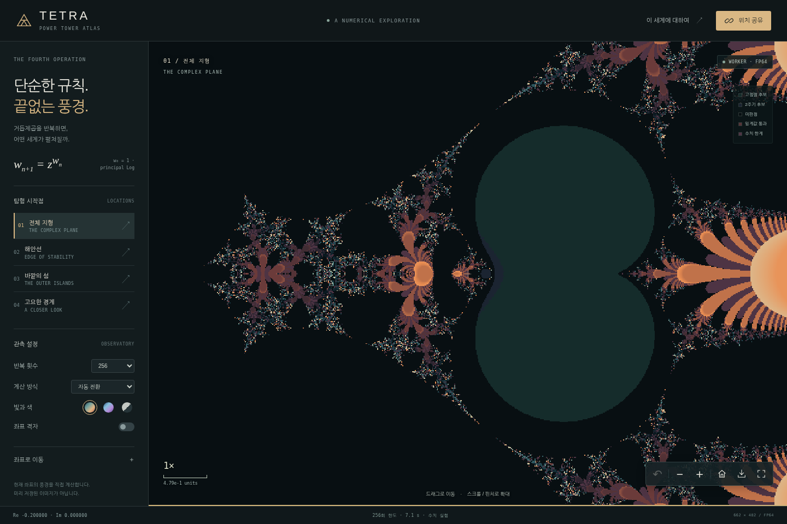

# TETRA — Power Tower Atlas

**단순한 규칙. 끝없이 궁금해지는 풍경.**

복소수 거듭제곱 탑을 브라우저에서 계산하며 탐험하는 웹앱입니다. 지도를 움직이듯 이동하고, 경계를 확대하고, 발견한 좌표를 링크로 공유하세요.

저장된 이미지를 확대하는 것이 아닙니다. 카메라가 바뀌면 새 좌표에서 `wₙ₊₁ = exp(wₙ · Log(z))`를 다시 계산합니다.



> **0.3.0 · 실험용 프리릴리스 / 정식 프로덕션 승인 보류**  
> WebGPU, 최대 4개 Worker 병렬 계산, OffscreenCanvas 전송을 추가했습니다. 지원되지 않는 기능은 WebGL2·Worker·픽셀 버퍼로 복구합니다. 소프트웨어 GPU와 Chromium 모바일 에뮬레이션 검증은 통과했습니다. 물리 GPU·iPhone/Safari 및 공개 HTTPS는 아직 미검증입니다. 무제한 정밀도·고해상도·실시간 성능을 보장하지 않습니다.

[GitHub 저장소](https://github.com/MongLong0214/Tetration) · [원격 CI 실행 기록](https://github.com/MongLong0214/Tetration/actions)


[시작하기](#시작하기) · [조작](#조작) · [계산과-한계](#계산과-한계) · [배포](#배포) · [최종 리뷰](docs/PRODUCTION_REVIEW.md) · [검증 증거](docs/VALIDATION.md)

## 주요 기능

| 기능 | 구현 |
| --- | --- |
| 탐험 | 드래그, 커서 중심 휠 확대, 더블클릭, 방향키, 이전 위치 |
| 모바일 | 한 손가락 이동, 두 손가락 핀치, 접이식 설정 패널 |
| 시작점 | 전체 지형·해안선·바깥의 섬·고요한 경계 |
| 표시 | 팔레트 3종, 64–1,024회 반복 한도, 좌표 격자 |
| 공유 | 긴 소수 좌표를 문자열 그대로 URL hash에 저장·복원 |
| PNG | 현재 화면 저장, 미완료 화면은 `PARTIAL PREVIEW` 표시 |
| 정밀도 | 검증된 WebGPU / WebGL2 FP32 → 병렬 Worker FP64 → BigInt 고정소수점 |
| 접근성 | 키보드 조작, 이름 있는 대화상자, 모바일 패널 포커스 관리 |

앱 런타임에는 npm 패키지, 외부 CDN, API 키, 로그인, 데이터베이스, 서버 계산, 추적기가 없습니다. 호스팅 제공자의 요청 처리·접근 로그는 앱 내부 동작과 별개입니다. 브라우저 검사에 쓰는 Python 패키지는 선택적 개발 도구입니다.

## 시작하기

**Node.js 24 권장, Node.js 22 또는 24와 npm**을 사용합니다. `.nvmrc`는 24입니다. 별도 `npm install` 없이 실행할 수 있습니다. 이번 Work 검증은 Node.js 24.19.0에서 수행했습니다. GitHub Actions는 Node 24용으로 구성했으며 실제 실행 상태는 위 Actions 링크와 [게시 기록](docs/PUBLISHING.md)에서 확인합니다.

```bash
npm test
npm run dev
```

`http://localhost:4173`을 엽니다.

```bash
npm run build    # dist/index.html 생성
npm start        # 로컬 서버
```

개발 서버는 기본적으로 `127.0.0.1`에만 바인딩하고 시작할 때 빌드합니다. HMR이나 파일 감시는 없습니다. 수정 후 다시 빌드하고 새로고침하세요. 다른 기기와의 LAN 테스트가 필요할 때만 명시적으로 `HOST=0.0.0.0 npm run dev`를 사용하세요. 이 개발 서버를 인터넷에 직접 노출하지 마세요.

직접 HTML을 열 수 있는 브라우저도 있지만, Worker·공유·다운로드는 로컬 서버 또는 HTTPS 호스팅 사용을 권장합니다. iOS 파일 미리보기는 검증하지 않았습니다.

## 조작

| 목적 | 조작 |
| --- | --- |
| 이동 | 마우스/한 손가락 드래그, 방향키 |
| 확대·축소 | 휠, 핀치, `+ / −`, 지도에 포커스 후 `+ / -` 키 |
| 특정 위치 확대 | 더블클릭 |
| 초기 위치 | `Home` 또는 집 모양 버튼 |
| 이전 위치 | 돌아가기 버튼, 지도에 포커스 후 `Alt + ←` |
| 좌표 입력 | 설정의 **좌표로 이동** |
| 공유 | 상단 **위치 공유**, 복사 실패 시 수동 복사 대화상자 |
| 설정 닫기 | 닫기 버튼 또는 `Escape` |
| 저장 | 지도 아래 PNG 저장 버튼 |

이전 위치는 현재 세션 메모리에 최대 80개 보관합니다. 영구 북마크 기능은 없습니다. 다시 방문할 위치는 공유 URL을 브라우저 북마크로 저장하세요. 모바일 설정 패널을 열면 포커스가 패널 안에 머물고, 닫으면 메뉴 버튼으로 돌아옵니다.

## 계산과 한계

```text
w₀ = 1
wₙ₊₁ = exp(wₙ · Log(z))
Log(z) = ln|z| + i Arg(z)
Arg(z) ∈ (−π, π]; 음의 실수축에서는 +π
z = 0은 계산 대상에서 제외
```

정수 높이의 거듭제곱 탑을 유한 번 반복하는 실험입니다. 실수·복소수 높이에 대한 테트레이션의 해석적 확장은 아닙니다.

| 관측 상태 | 의미 |
| --- | --- |
| 고정점 후보 | 연속한 값이 허용 오차 내에서 여러 번 가까워짐 |
| 2주기 후보 | 두 단계 전 값과 여러 번 가까워짐 |
| 미판정 | 선택한 반복 한도 안에서 다른 판정 조건에 도달하지 않음 |
| 임계값 통과 | 계산 중 `|w| > 10¹⁰`에 해당하는 조건을 관측 |
| 수치 한계 | 원점·위상 계산 한도·오버플로·언더플로 등 |

**어떤 색도 수렴·주기성·발산에 대한 증명이 아닙니다.** 흑백 팔레트는 고정점 후보·2주기 후보·미판정을 같은 어두운 색으로 표시합니다. 검은 영역 전체를 수렴 영역으로 해석하지 마세요. 엔진마다 허용 오차가 달라 경계의 결과가 다를 수 있습니다.

| 제한 | 현재 구현 |
| --- | --- |
| 카메라 | 소수점 아래 256자리 고정소수점 |
| 고정밀 궤도 | 확대 깊이에 따라 40–240자리 |
| 화면 가로 범위 | `1e-200` 이상, `1e12` 이하 |
| 중심 좌표 각 성분 | `−1e12` 이상, `1e12` 이하 |
| 반복 한도 | 64 / 128 / 256 / 512 / 1,024 |
| 고정밀 최종 단계 | 최대 가로 **72개 계산 샘플** |

고정밀 화면은 저해상도이며 계산에 시간이 걸립니다. 0.2.0의 단일 Worker 테스트에서는 `span=1e-200`, 중심 `0.5 + 0i`, 반복 한도 64인 한 번의 렌더가 약 19.1초 걸렸습니다. 0.3.0의 실행 시간은 [검증 JSON](docs/review/modern-2026-10-04/browser-review.json)에 기록합니다. 일반 기기의 성능 예측이나 경계 좌표의 최악 시간은 아닙니다.

BigInt의 `ln / exp / sin / cos / atan2 / sqrt`는 직접 구현한 절삭 방식의 고정소수점 연산입니다. 구간 산술 또는 인증된 수치 엔진이 아닙니다. 좌표를 많이 보존하는 것과 경계가 정확하다는 것은 다릅니다. 독립 참조 계산과의 일부 유한 궤도 비교는 통과했지만 모든 좌표·반복 횟수의 정확성을 증명하지 않습니다.

## 구조

| 경로 | 역할 |
| --- | --- |
| WebGPU / WGSL | 보안 원점·어댑터·기준점 검사 통과 시 FP32 미리보기 |
| WebGL2 / GLSL | WebGPU 미지원·초기화 실패·장치 손실 시 FP32 대체 경로 |
| Worker pool | CPU 코어 수를 참고해 1–4개 Worker에서 FP64 또는 BigInt 타일 분담 |
| OffscreenCanvas | Worker가 만든 타일을 ImageBitmap으로 이전하고 사용 후 해제 |
| 픽셀 버퍼 | OffscreenCanvas 미지원 시 transferable ArrayBuffer 전송 |
| scheduler.yield | 지원하는 Worker에서는 타일 사이 양보, 미지원이면 타이머 사용 |

이동하면 이전 Worker와 예약된 그리기를 취소하고 오래된 응답을 무시합니다. 이전 화면을 이동한 이미지는 **미리보기**입니다. 정지하면 새 좌표로 다시 계산합니다. GPU 정밀도가 부족하면 CPU로 전환합니다. 엔진 전환 기준은 보수적 휴리스틱이며 오차 상한의 증명이 아닙니다.

WebGPU도 FP32 계산입니다. FP64·BigInt의 대체 정확도 엔진이 아니며 어댑터와 경계 좌표에 따라 결과가 달라질 수 있습니다. 5개 안정 기준점 검사는 일부 회귀를 찾는 장치입니다. 모든 입력을 보증하지 않습니다. GPU 제출 완료 후 상태를 갱신하고, PNG에는 화면 표시 전에 보존한 스냅샷을 사용합니다. 영구 저장·네트워크·분석 추적을 추가하지 않았습니다.

## 보안과 빌드

`build.cjs`는 실행할 스크립트·스타일의 정확한 SHA-256을 계산해 CSP에 넣습니다. `unsafe-inline`이나 `unsafe-eval`로 전체 인라인 코드를 허용하지 않습니다. 네트워크 연결은 `connect-src 'none'`, Worker는 `blob:`만 허용합니다. 보안 정책 아래의 정상 렌더, 허가되지 않은 스크립트 차단, 외부 fetch 차단을 검사했습니다.

빌드 후 HTML의 스크립트·스타일을 수정하면 해시와 맞지 않게 됩니다. 소스를 수정한 뒤 **반드시 재빌드**하세요. 호스팅 서비스가 분석 스크립트를 삽입하거나 자동 변환하면 차단될 수 있으므로 배포에서 확인해야 합니다. 분석/추적 기능은 기본 제공하지 않습니다.

Vercel 설정에는 프레이밍 차단, MIME sniffing 차단, referrer 제한, 카메라·마이크·위치 권한 차단과 재검증 캐시 정책이 포함됩니다. CSP 해시는 HTML meta, `frame-ancestors`는 HTTP 헤더로 적용됩니다. 다른 호스트로 옮기면 헤더도 별도로 설정하세요. CSP 추가가 모든 취약점이 없다는 보증은 아닙니다.

## 배포

### Vercel

```text
Framework Preset: Other
Build Command: npm run build
Output Directory: dist
Install Command: echo No dependencies
Environment Variables: 없음
```

새 GitHub 저장소를 가져오거나 인증된 로컬 환경에서 실행하세요.

```bash
npx vercel login
npx vercel --prod
```

기존 프로젝트/도메인에 의도 없이 연결하지 마세요. 요금과 공개 접근 권한은 호스팅 계정 설정에 따릅니다. 현재 연결은 Vercel 팀 프로젝트 조회에서 `403`을 반환했습니다. 팀 범위 재연결 전까지 공개 배포를 완료했다고 주장하지 않습니다. 기존 프로젝트·도메인은 변경하지 않았습니다.

### 다른 정적 호스팅

`dist/index.html`을 제공하고 `vercel.json`과 동등한 보안 헤더를 설정하세요. URL hash 기반이므로 위치 공유를 위한 서버 라우트 rewrite는 필요 없습니다. HTTPS 주소에서 Worker, 클립보드, PNG, 보안 헤더를 다시 확인해야 합니다.

## 테스트와 CI

```bash
npm test                    # Node 테스트 59개
npm run build
```

선택적 브라우저 검증:

```bash
python3 -m venv .venv
. .venv/bin/activate
python3 -m pip install -r tests/requirements.txt
python3 -m playwright install chromium
npm run build
npm run test:browser
```

별도 터미널에서 서버 실행 후 원점 기반으로 검사할 수 있습니다.

```bash
TETRA_BASE_URL=http://127.0.0.1:4173 npm run test:browser
TETRA_BASE_URL=http://127.0.0.1:4173 npm run test:release
TETRA_BASE_URL=http://127.0.0.1:4173 npm run test:modern
```

시스템 Chromium을 사용하려면 `CHROMIUM_PATH`를 지정하세요. `test:browser`에서 URL을 생략하면 빌드 HTML을 직접 주입합니다. 이번 Work 검사는 실제 HTTP 원점에서 실행했습니다. `test:release`는 HTTP 서버와 WebGL2가 필요하며 실행 환경·결과를 별도 기록합니다. loopback HTTP 검증은 공개 HTTPS 배포 검증이 아닙니다.

| 이번 리뷰에서 실행 | 결과 |
| --- | --- |
| 수치·빌드·CSP·HTTP 서버 | **59/59** |
| HTTP Chromium 입력·렌더·보안·모바일 에뮬레이션 | **29/29** |
| 브라우저 WebGL2·컨텍스트 손실·전환·클립보드·헤더 | **16/16** |
| WebGPU 15개 기준 픽셀·PNG·장치 손실·병렬 계산·기능 미지원 | **10/10** |
| 소프트웨어 OpenGL ES 셰이더/기준 픽셀 | **8/8** |
| 300자리 독립 참조와 240자리 유한 궤도 비교 | **12개 입력 통과** — 위 59개에 포함 |

브라우저는 Chromium 153.0.8010.0 / Playwright 1.57.0이며 WebGL2 드라이버는 SwiftShader입니다. 별도 GLES 검사는 llvmpipe입니다. 둘 다 하드웨어 GPU 검증이 아닙니다. `.github/workflows/ci.yml`은 Node 24와 HTTP 원점 기반의 세 Chromium 검사(`test:browser`, `test:release`, `test:modern`)를 수행하도록 설정했습니다. Actions는 commit SHA로 고정하고 권한은 `contents: read`로 제한했습니다. 실제 원격 실행 상태는 Actions와 게시 기록에서 확인합니다.

전체 명령·환경·원본 로그는 [검증 기록](docs/VALIDATION.md)에 있습니다. CI 브라우저 종속성은 빌드/런타임 의존성이 아닙니다.

## 파일 안내

```text
src/                     UI, 카메라, GPU, Worker, 수치 코어
build.cjs / serve.cjs     단일 HTML 빌드 / 로컬 전용 정적 서버
vercel.json              정적 배포와 보안 헤더
.github/workflows/ci.yml  수치·브라우저 CI
tests/                   수치 회귀, 독립 참조, 브라우저/GLES 검사
docs/PRODUCTION_REVIEW.md 최종 판정, 수정 사항, 출시 전 확인 항목
docs/VALIDATION.md        재현 명령과 환경 한계
docs/review/work-2026-10-04/  Work 재검증 원본 증거·화면·SHA-256 목록
scripts/publish-github.sh 새 공개 GitHub 저장소 최초 게시 도우미
```

`package.json`의 `private: true`는 npm 발행 방지 설정이며 GitHub 공개 여부와 무관합니다. 저장소 최초 생성 절차와 연결 제약은 [PUBLISHING.md](docs/PUBLISHING.md)에 있습니다.

## 기여와 다음 작업

버그에는 공유 URL, 브라우저·기기, 반복 한도, 엔진·정밀도·계산 해상도를 함께 남겨 주세요. 판정 로직 변경에는 재현 테스트와 독립 참조값을 포함하세요. 남은 우선순위는 원격 CI 확인, 하드웨어 GPU/물리 Safari 검증, 공개 HTTPS smoke test, 극단적 확대의 연산 비용·해상도 개선입니다. 새 프레임워크·백엔드·데이터베이스 추가는 현재 필수 과제가 아닙니다.

## 참고와 라이선스

주제의 출발점은 [DMT PARK 영상](https://youtu.be/PROONug8hCM)입니다. README 이미지는 영상 프레임이 아니라 앱의 실제 계산 화면입니다.

- [MDN: CSP script-src](https://developer.mozilla.org/en-US/docs/Web/HTTP/Reference/Headers/Content-Security-Policy/script-src)
- [Node.js 지원 버전](https://nodejs.org/en/about/previous-releases)
- [Vercel deploy](https://vercel.com/docs/cli/deploy)

별도 라이선스를 임의로 추가하지 않았습니다. 적용할 라이선스는 저장소 소유자가 선택합니다.
