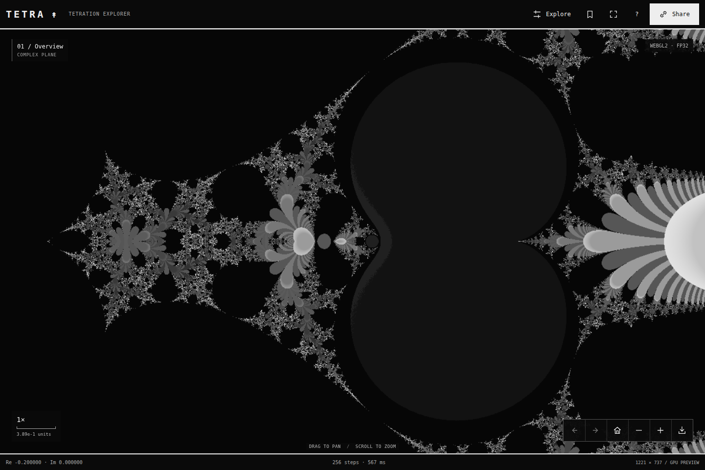

# TETRA

A browser-native tetration explorer. Move through the complex plane, inspect its boundaries, save coordinates and share what you find.



[](https://github.com/MongLong0214/Tetration/actions)

**0.4.0 · beta release candidate.** Public deployment and device qualification are tracked in the [production review](docs/PRODUCTION_REVIEW.md). The app observes finite iterations; it does not prove convergence or divergence.

## Explore

The map fills the workspace. Open **Explore** for starting points, render settings, precise coordinates and saved views. **Focus** hides the interface. **Share** copies the exact current view, or opens native sharing on supported touch devices. **Export PNG** saves the displayed result and labels incomplete previews.

| Action | Input |
| --- | --- |
| Pan | Drag / arrow keys; Shift + arrow for larger steps |
| Zoom | Scroll / pinch / + and − |
| Zoom into a point | Double-click |
| Overview / starting points | Home / 1–4 |
| Previous / next view | Alt + Left / Right |
| Focus / controls | F / C |
| Saved views / share / PNG | B / S / E |
| Grid / guide | G / ? |

All three shading modes are monochrome: **Bands**, **Inverse**, **Binary**. Binary combines fixed-point candidates, period-2 candidates and unresolved samples into one dark tone.

Save up to 24 named views on the current device. Storage is optional: the app remains usable when it is blocked. A shared URL is a separate, portable copy of your coordinates. There is no account or cloud synchronization.

## Run

Node.js 22 or 24; `.nvmrc` selects 24. No npm installation is required to build or run the app.

```bash
npm test
npm run dev
# http://localhost:4173
```

```bash
npm run build       # dist/index.html
npm start          # serve the build locally
```

The development server binds to loopback. Use `HOST=0.0.0.0` only for intentional LAN testing. It is not a public hosting server. There is no file watcher: rebuild after editing. HTTPS hosting is recommended for sharing and graphics features.

## Computation

For each complex base `z`:

```text
w₀ = 1
wₙ₊₁ = exp(wₙ · Log(z))
Arg(z) ∈ (−π, π]; the negative real axis uses +π
```

Zero is excluded. This is finite, integer-height power-tower iteration, not an analytic extension to arbitrary real or complex heights.

| Observation | Interpretation |
| --- | --- |
| Fixed-point candidate | Consecutive values repeatedly approach within a tolerance |
| Period-2 candidate | Values repeatedly approach the value two steps earlier |
| Unresolved | No other stopping condition within the iteration limit |
| Threshold crossed | A condition corresponding to magnitude above 10¹⁰ was observed |
| Numerical limit | Undefined input, overflow, underflow or precision/range constraints |

**No shade proves convergence, periodicity or divergence.** Engines use different numerical tolerances, so boundaries can change between modes.

| Limit | Implementation |
| --- | --- |
| Camera coordinates | 256 decimal places, fixed point |
| Orbit precision | 40–240 decimal places |
| Horizontal span | 1e−200 to 1e12 |
| Each coordinate component | −1e12 to 1e12 |
| Iteration limit | 64, 128, 256, 512 or 1,024 |
| Final deep-view resolution | At most 72 horizontal samples |

Deep views can be slow and visibly coarse. BigInt arithmetic uses truncation, not certified error intervals. Preserving a coordinate is not the same as proving its computed boundary. Infinite precision, unlimited resolution and real-time rendering are not promised.

## Rendering and privacy

- Qualified **WebGPU / WGSL**, then **WebGL2 / GLSL**, provide FP32 previews. Five stable reference pixels gate WebGPU initialization.
- A pool of **1–4 Workers** handles FP64 and high-precision computation. Deep-view limits stay the same.
- **OffscreenCanvas / ImageBitmap** transfers tiles where supported; transferable pixel buffers remain the fallback.
- Moving cancels active work. Old results cannot replace a newer view. WebGPU snapshots are requested before presentation expires and resolved asynchronously.
- No framework, runtime npm dependency, external computation API, analytics script or login. Saved views are written only after an explicit save/remove action. Hosting access logs are separate from the app.

The build hashes exact script and stylesheet bytes into its CSP. It does not permit `unsafe-inline` or `unsafe-eval`. `connect-src 'none'` blocks app fetches; Workers are limited to blob URLs. Do not modify the built inline code without rebuilding.

## Deploy

Import **MongLong0214/Tetration** into Vercel with the committed configuration:

| Setting | Value |
| --- | --- |
| Framework | Other |
| Build command | `npm run build` |
| Output directory | `dist` |
| Install command | `echo No dependencies` |
| Environment variables | None |

`vercel.json` includes anti-framing, MIME sniffing, referrer, permissions and cache headers. The HTML contains the script/style CSP. Other hosts must supply equivalent response headers. URL fragments carry the view; no server route rewrite is needed.

The connected Vercel account currently rejects the intended team scope with HTTP 403. See [publication status](docs/PUBLISHING.md) for the actual deployment result. No live URL is claimed until HTTPS verification succeeds.

## Verify

```bash
npm test
npm run build
python3 -m pip install -r tests/requirements.txt
npm install --no-save --package-lock=false --ignore-scripts axe-core@4.11.0
python3 -m playwright install --with-deps chromium webkit
# Start npm start in another terminal, then:
TETRA_BASE_URL=http://127.0.0.1:4173 npm run test:browser
TETRA_BASE_URL=http://127.0.0.1:4173 npm run test:release
TETRA_BASE_URL=http://127.0.0.1:4173 npm run test:modern
TETRA_BASE_URL=http://127.0.0.1:4173 npm run test:explorer
TETRA_BASE_URL=http://127.0.0.1:4173 npm run test:webkit
```

`CHROMIUM_PATH` selects an existing Chromium executable. `AXE_CORE_PATH` selects an existing axe-core script. These are test-only tools. The app does not ship them. GitHub Actions runs the checks on a served origin and preserves browser evidence for seven days.

See [validation evidence](docs/VALIDATION.md), [production review](docs/PRODUCTION_REVIEW.md) and [changelog](CHANGELOG.md). Linux software graphics, mobile emulation and Playwright WebKit are not physical GPU or iPhone/Safari qualification.

## Structure

| Path | Purpose |
| --- | --- |
| `src/main.js` | Camera, input, navigation, orchestration and export |
| `src/core.js`, `src/precision.js` | Finite orbit classification and numerical arithmetic |
| `src/gpu.js`, `src/webgpu.js` | GPU preview renderers |
| `src/worker.js`, `src/saved.js` | Parallel tiles and validated local saved views |
| `src/index.html`, `src/style.css` | English monochrome interface |
| `tests/` | Numerical references and browser regression suites |
| `docs/review/v0.4.0/` | Current review evidence |

Report bugs with a shared view URL, device/browser, iteration limit and precision mode. Numerical changes should include a reproducible case and independent reference values.

No license has been added or changed. The repository owner selects the license. `private: true` prevents npm publication; it does not make this GitHub repository private.
